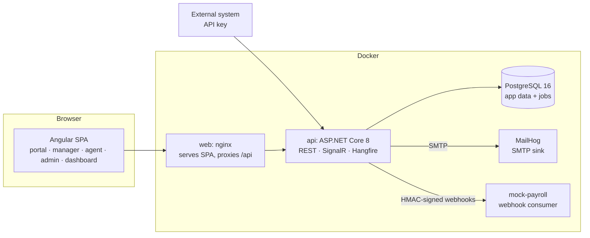
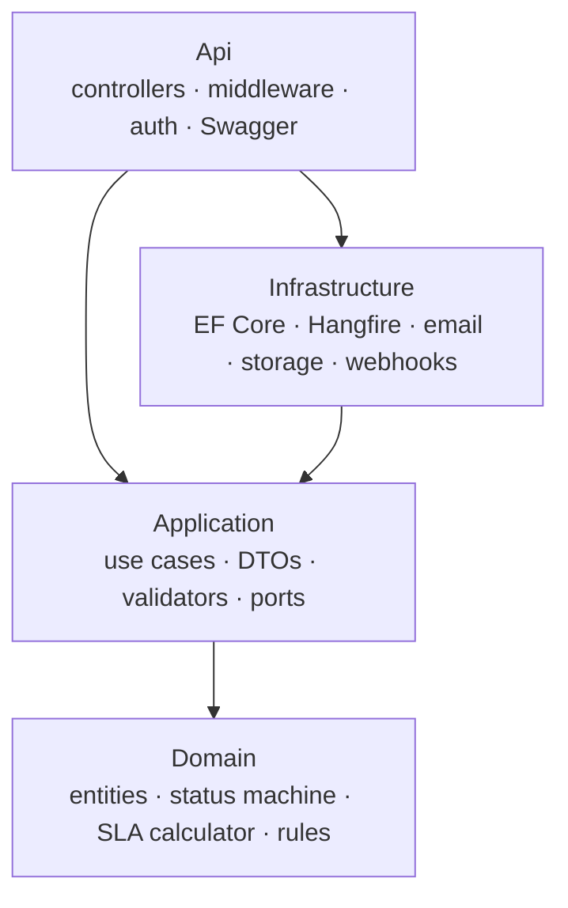

# HR Service Desk & SLA Management System

[](https://github.com/Eya2/HR-Service-Desk-SLA-Management-System/actions/workflows/backend.yml)
[](https://github.com/Eya2/HR-Service-Desk-SLA-Management-System/actions/workflows/frontend.yml)


A multi-tenant **HR case management platform** in the style of the HR service delivery suites used by large employers. Employees submit HR requests (payslip corrections, certificates, leave, bank detail changes…) from a catalog. Requests go through configurable **approval workflows**, are routed to the right HR team, and are tracked against **business-hours-aware SLAs** with automatic **escalation**. HR leadership follows everything on **dashboards**, and external systems such as payroll integrate through a **REST API and signed webhooks**.

> **Status:** in active development, delivered phase by phase. See the [roadmap](#roadmap).

---

## Table of contents

- [Why this project](#why-this-project)
- [Features](#features)
- [Tech stack](#tech-stack)
- [Architecture](#architecture)
- [Repository structure](#repository-structure)
- [Getting started](#getting-started)
- [Roadmap](#roadmap)
- [Demo scenario](#demo-scenario)
- [Engineering principles](#engineering-principles)

---

## Why this project

HR teams handle hundreds of sensitive, deadline-bound requests every month. Without a dedicated tool, those requests end up in mailboxes and spreadsheets: deadlines slip, approvals get lost, confidential cases leak, and nobody can say how the service is performing.

This system brings IT-service-management discipline (catalog, workflows, SLAs, escalation, audit) to HR, while respecting HR-specific constraints: confidentiality, GDPR retention, country-specific calendars (Tunisia, France) and multilingual users (French, English, Arabic).

## Features

| Area | What it does |
|---|---|
| **Request catalog** | Request types by category (Payroll, Leave & Absence, Contracts, Benefits, Onboarding/Offboarding, Training, Expenses, Certificates, Confidential), each with its own **dynamic form** defined as a JSON schema |
| **HR cases (tickets)** | Reference numbers (`HR-2026-000123`), priorities, public replies and internal notes, attachments with type and size validation |
| **Status machine** | Explicit transition table (New → PendingApproval → Open → InProgress → WaitingOnEmployee → Resolved → Closed, plus Reopened, Rejected, Cancelled) with role-based permissions; every transition is audited |
| **Approval workflows** | Ordered approval steps per request type (Manager, HR Officer, Payroll Specialist…), edited by HR Admins; a rejection ends the flow |
| **Assignment** | Manual, round-robin and least-loaded strategies per team, with optimistic concurrency so two agents can't claim the same case |
| **SLA engine** | First-response and resolution targets per priority and request type, computed in **business hours** (working days, public holidays for Tunisia and France); the clock pauses while waiting on the employee or on approval; OnTrack / AtRisk / Breached states |
| **Escalation** | Rules such as "AtRisk → notify assignee" or "Breached → bump priority and reassign to tier 2", fired once per case (idempotent) |
| **Notifications** | Real-time in-app bell (SignalR) and email |
| **Confidentiality & GDPR** | Confidential cases (e.g. harassment reports) visible only to a restricted HR group, enforced in database queries; audit log of sensitive reads; automatic anonymization after a retention period |
| **Dashboards** | SLA compliance, response and resolution times, backlog, volume over time (pay-day peaks), agent workload, reopen rate, CSV export |
| **Employee portal** | Catalog search, dynamic forms, "My requests" with a status timeline, knowledge base with article suggestions while typing, satisfaction rating |
| **Manager view** | Pending approvals queue, team requests and stats |
| **Integration** | Per-tenant API keys, REST endpoints, HMAC-signed outgoing webhooks with retry, and a mock payroll system for demos |
| **Multi-tenancy** | Every business row carries a `TenantId`, enforced by a global EF Core query filter |
| **i18n** | French, English and Arabic (right-to-left layout) |

### Roles

`Employee` · `Manager` · `HR Officer` · `Payroll Specialist` · `HR Admin` · `Auditor` (read-only) · `SuperAdmin` (tenant management)

## Tech stack

| Layer | Technologies |
|---|---|
| **Backend** | .NET 8, ASP.NET Core Web API, Entity Framework Core 8, PostgreSQL (Npgsql), MediatR (CQRS), FluentValidation, Mapperly, Serilog, Swagger/OpenAPI |
| **Background jobs** | Hangfire (PostgreSQL storage) |
| **Auth** | JWT access tokens + rotating refresh tokens, role- and policy-based authorization |
| **Frontend** | Angular 22 (standalone components, signals, lazy-loaded routes), Angular Material, Reactive Forms, RxJS, Chart.js, ngx-translate |
| **Tests** | xUnit, FluentAssertions, Testcontainers (real PostgreSQL), Karma + Jasmine |
| **DevOps** | Docker, Docker Compose, nginx, GitHub Actions, MailHog |

## Architecture



The backend follows **Clean Architecture**:



- **Domain** has no framework dependency. The status machine, business-time calculator, assignment strategies and escalation evaluator are pure and unit-tested.
- **Application** holds one folder per use case (command or query, handler, validator, DTOs), dispatched through MediatR with validation and logging pipelines.
- **Infrastructure** implements the ports: EF Core with a tenant query filter, interceptors that stamp tenant and timestamps, jobs, email, file storage.
- **Api** stays thin: it binds requests, sends them to MediatR and maps results to HTTP and RFC 7807 ProblemDetails.

Full design notes: [`docs/ARCHITECTURE.md`](https://github.com/Eya2/HR-Service-Desk-SLA-Management-System/blob/backend/docs/ARCHITECTURE.md) (on the `backend` branch).

## Repository structure

The code is split into one branch per application:

| Branch | Content |
|---|---|
| [`main`](https://github.com/Eya2/HR-Service-Desk-SLA-Management-System/tree/main) | This README |
| [`backend`](https://github.com/Eya2/HR-Service-Desk-SLA-Management-System/tree/backend) | `backend/` (.NET solution, Dockerfile, compose for postgres, api and mailhog), `docs/`, backend CI |
| [`frontend`](https://github.com/Eya2/HR-Service-Desk-SLA-Management-System/tree/frontend) | `frontend/` (Angular app, nginx Dockerfile, compose for the web container), frontend CI |

Each folder is self-contained, and the branches share nothing but this README, so they can be merged together without conflicts.

## Getting started

### Prerequisites

- Docker Desktop (or Docker Engine with Compose v2)
- For local development without Docker: .NET SDK 8, Node.js 24 LTS

### 1. Start the backend (PostgreSQL, API, MailHog)

```bash
git clone -b backend https://github.com/Eya2/HR-Service-Desk-SLA-Management-System.git hr-backend
cd hr-backend/backend
cp .env.example .env        # then set POSTGRES_PASSWORD
docker compose up -d --build
```

| Service | URL |
|---|---|
| API (Swagger) | http://localhost:5080/swagger |
| Health | http://localhost:5080/health/ready |
| MailHog | http://localhost:8025 |

### 2. Start the frontend

```bash
git clone -b frontend https://github.com/Eya2/HR-Service-Desk-SLA-Management-System.git hr-frontend
cd hr-frontend/frontend
docker compose up -d --build
```

The app is served at http://localhost:8080 and forwards `/api` to the backend on port 5080.

### Local development (without Docker for the apps)

```bash
# backend: needs a PostgreSQL instance (e.g. `docker compose up -d postgres` in backend/)
cd backend
dotnet run --project src/HrServiceDesk.Api        # http://localhost:5080/swagger

# frontend: proxies /api to http://localhost:5080
cd frontend
npm ci
npm start                                         # http://localhost:4200
```

### Running the tests

```bash
cd backend && dotnet test          # unit + integration (Testcontainers needs Docker running)
cd frontend && npm run test:ci     # Karma, headless Chrome
```

## Roadmap

The project is delivered in 13 phases. Each phase ends with a green build and test suite and is merged before the next one starts.

| # | Phase | Scope | Branch | Status |
|---|---|---|---|---|
| 1 | **Scaffolding** | Solution structure, EF Core + tenant filter, Serilog, Swagger, ProblemDetails, health checks, Docker Compose, Angular shell, CI | backend · frontend | ✅ Done |
| 2 | **Authentication** | Users, roles, policies, JWT + rotating refresh tokens, password policy, rate limiting; Angular login, layout, guards, interceptor | backend · frontend | ⏳ Next |
| 3 | **Catalog & tickets** | Request types with JSON form schema, tickets CRUD, reference numbers, public/internal comments, attachments; employee portal | backend · frontend | 🔲 Planned |
| 4 | **Status machine & audit** | Transition table with role permissions, audit events, timeline UI, exhaustive tests | backend · frontend | 🔲 Planned |
| 5 | **Approval workflows** | Workflow engine, admin workflow editor, manager approval queue | backend · frontend | 🔲 Planned |
| 6 | **Teams & assignment** | Teams, manual / round-robin / least-loaded strategies, optimistic concurrency, agent queue | backend · frontend | 🔲 Planned |
| 7 | **SLA foundations** | Business calendars and holidays (TN/FR), business-time calculator, SLA policies, pause/resume | backend · frontend | 🔲 Planned |
| 8 | **SLA monitor & escalation** | Hangfire job every minute, escalation rules (idempotent), in-app and email notifications | backend · frontend | 🔲 Planned |
| 9 | **Confidentiality & GDPR** | Restricted HR group, sensitive-access audit log, retention and anonymization job, audit viewer | backend · frontend | 🔲 Planned |
| 10 | **Dashboards** | KPIs, charts, date and team filters, CSV export | backend · frontend | 🔲 Planned |
| 11 | **Knowledge base, CSAT & i18n** | FAQ with suggestions while typing, satisfaction ratings, FR / EN / AR with RTL | backend · frontend | 🔲 Planned |
| 12 | **Integration** | API keys, integration endpoints, HMAC-signed webhooks with retry, mock payroll container | backend | 🔲 Planned |
| 13 | **Demo & polish** | Full seed (2 tenants, every role), end-to-end demo script, final documentation | backend · frontend | 🔲 Planned |

### Definition of done

- `docker compose up` starts the full system with seeded demo data.
- All tests pass in CI.
- The [demo scenario](#demo-scenario) works end to end.

## Demo scenario

1. An **employee** submits a *payslip correction* through the portal's dynamic form.
2. Their **manager** approves it from the approval queue.
3. The case is routed to the **payroll** team; its SLA deadline is computed in business hours and **skips a public holiday**.
4. Time passes: the case turns **AtRisk**, then **Breached**, and the escalation rules notify the manager and reassign it to a higher tier.
5. The **dashboard** reflects the breach, and the full **audit trail** is visible on the case.
6. Meanwhile, a **confidential** harassment report stays invisible to a regular HR agent.

## Engineering principles

- Clean Architecture, with business rules in the domain and no logic in controllers
- `async`/`await` end to end, DTOs separate from entities, RFC 7807 ProblemDetails for every error
- Multi-tenant isolation and confidentiality enforced on the server, in queries, never only in the UI
- Unit tests for domain logic, and integration tests against a real PostgreSQL through Testcontainers
- No secrets in the repository, and no personal data in logs
- Small, conventional commits (`feat:`, `fix:`, `test:`, `docs:`…)
