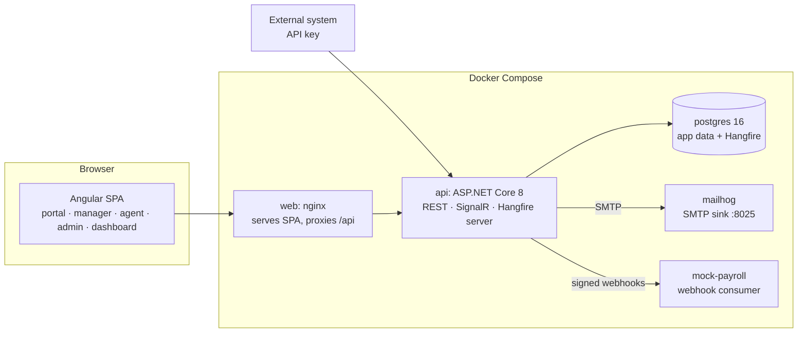

# HR Service Desk & SLA Management: Architecture Plan

This document describes how the system is structured, the key design decisions, and the delivery phases. It is a living document and will be refined as each phase lands.

## 1. Overview

A multi-tenant HR case management platform. Employees submit HR requests from a catalog, requests go through configurable approval workflows, get assigned to HR teams, and are tracked against business-hours-aware SLAs with automatic escalation. HR leadership gets dashboards, and external systems (payroll) integrate through an API and webhooks.



## 2. Repository layout and branches

The GitHub repository uses one branch per application, both starting from `main`:

| Branch | Content |
|---|---|
| `main` | `README.md` only: project description, architecture overview and roadmap |
| `backend` | `backend/`, `docs/`, `.github/workflows/backend.yml` |
| `frontend` | `frontend/`, `.github/workflows/frontend.yml` |

Each folder is self-contained (own Dockerfile, `docker-compose.yml`, `.env.example`, `.gitignore`), so the two branches share no file except the README and can be merged later without conflicts.

```
/backend                              # branch: backend
  HrServiceDesk.sln
  global.json                         # pins .NET SDK 8
  Directory.Build.props               # nullable, warnings-as-errors, analyzers
  Directory.Packages.props            # central package versions
  .config/dotnet-tools.json           # dotnet-ef local tool
  Dockerfile, docker-compose.yml      # postgres, api, mailhog (+ mock-payroll in phase 12)
  src/
    HrServiceDesk.Domain/             # entities, value objects, enums, domain services, domain errors
    HrServiceDesk.Application/        # use cases (commands/queries), DTOs, validators, interfaces (ports)
    HrServiceDesk.Infrastructure/     # EF Core, migrations, repositories, Hangfire jobs, email, storage, webhooks
    HrServiceDesk.Api/                # controllers, auth setup, middleware, ProblemDetails, Swagger, SignalR hub
  tests/
    HrServiceDesk.Domain.Tests/       # pure unit tests (status machine, SLA calculator, assignment, escalation)
    HrServiceDesk.Application.Tests/  # handler tests with fakes
    HrServiceDesk.IntegrationTests/   # WebApplicationFactory + Testcontainers PostgreSQL
/docs                                 # branch: backend (ARCHITECTURE.md, demo-script.md)
/frontend                             # branch: frontend (Angular workspace, single app)
  Dockerfile, docker-compose.yml      # nginx serving the SPA, proxying /api to the backend
  nginx/default.conf.template
  src/app/
    core/        # API clients, auth service, interceptors, guards, layout shell, i18n, notifications
    shared/      # UI components, pipes, dynamic-form renderer
    features/
      auth/ portal/ manager/ agent/ admin/ dashboard/   # each lazy-loaded
```

## 3. Backend design

### 3.1 Clean Architecture dependency rule

`Api → Application → Domain`, and `Infrastructure → Application/Domain`. Domain has no framework dependencies (no EF, no ASP.NET). Application defines ports (`IAppDbContext`, `IClock`, `ICurrentUser`, `ITenantContext`, `IEmailSender`, `IFileStorage`, `INotificationPublisher`, `IWebhookDispatcher`); Infrastructure implements them.

### 3.2 Use cases (CQRS-style)

- One folder per feature in Application (`Tickets/Commands/CreateTicket`, `Tickets/Queries/GetTicketById`, ...), each containing the request record, handler, validator, and DTOs.
- **MediatR** for dispatch, with pipeline behaviors for validation (FluentValidation), logging, and transaction handling. Controllers stay thin: bind, `Send`, map the result to HTTP.
- Handlers return `Result<T>` for expected failures (not found, forbidden, validation, domain rule). A single mapper turns these into RFC 7807 `ProblemDetails`. Unexpected exceptions are handled by a global exception handler (no stack traces or sensitive data in responses).
- Read side uses EF projections straight to DTOs (`AsNoTracking`, `Select`), and the write side loads aggregates.
- Mapping uses **Mapperly** (source-generated, no reflection, compile-time checked).

> Note on MediatR licensing: recent MediatR versions moved to a commercial licence. I will pin the last Apache-2.0 release (12.x). If you prefer, I can write a ~50-line in-house dispatcher instead. Same for AutoMapper, which is why Mapperly is chosen.

### 3.3 Domain model highlights

- **Ticket** is the core aggregate: it owns its status, SLA clock, approvals, comments, and events. State changes happen only through methods (`Transition`, `Approve`, `Assign`, `AddComment`), never through public setters.
- **Status machine**: an explicit, static transition table `(from, to) → allowed roles + guard`. `TicketStatusMachine.CanTransition(...)` is pure and exhaustively unit-tested. Invalid transitions return a `DomainError` (`ticket.invalid_transition`), surfaced as 409/422 ProblemDetails. Every successful transition appends a `TicketEvent`.
- **Workflow engine**: `WorkflowDefinition` (per RequestType, versioned) with ordered `WorkflowStep`s. On submission, the ticket snapshots the workflow into `TicketApproval` rows, so later edits to the definition don't affect in-flight tickets. A rejection ends the flow (ticket → Rejected), and approval of the last step moves it to Open.
- **SLA calculator**: a pure domain service `BusinessTimeCalculator` that takes a `BusinessCalendar` (working hours per weekday, time zone, holidays) and computes `AddBusinessMinutes(start, minutes)` and `BusinessMinutesBetween(a, b)`. No `DateTime.Now` inside; time comes from `IClock` (`TimeProvider` in .NET 8). This will be the most heavily tested part (weekends, holidays, overnight, DST, partial days).
- **SLA clock** on the ticket: tracks `FirstResponseDueAt`, `ResolutionDueAt`, accumulated paused business minutes, and `PausedSince`. Pausing statuses (WaitingOnEmployee, PendingApproval) are configurable per SLA policy. Resuming recomputes the deadlines.
- **Assignment strategies**: `IAssignmentStrategy` with `Manual`, `RoundRobin`, and `LeastLoaded` implementations, selected per team (strategy pattern + factory).
- **Escalation**: `EscalationRule` (trigger + action + parameters) evaluated by a pure `EscalationEvaluator`. Idempotency is guaranteed by a unique index on `EscalationExecutions(TicketId, RuleId)`, so the same rule cannot fire twice even if two job runs race.

### 3.4 Persistence

- EF Core 8 + Npgsql, code-first migrations in Infrastructure, snake_case naming (`EFCore.NamingConventions`).
- **Multi-tenancy**: every business entity implements `ITenantOwned { Guid TenantId }`. A global query filter `e => e.TenantId == _tenant.TenantId` is applied automatically via model-building conventions to every `ITenantOwned` type, and a `SaveChanges` interceptor stamps `TenantId` on insert and refuses cross-tenant writes. `ITenantContext` is resolved from the JWT `tenant_id` claim (or from the API key for the integration API). SuperAdmin endpoints use an explicit `IgnoreQueryFilters()` path.
- **Confidentiality** is a second global filter on tickets: confidential tickets are visible only to the requester and members of the restricted HR group. This is enforced in the query, not the UI.
- **Concurrency**: PostgreSQL `xmin` mapped as a concurrency token on `Ticket` (and other contested rows). `DbUpdateConcurrencyException` becomes a 409 ProblemDetails ("ticket was modified by someone else").
- **Auditing**: `TicketEvent` for case history (status, assignment, approvals, SLA changes), plus an `AuditLog` table for sensitive reads and writes (who viewed a confidential ticket, who changed bank details). Created/modified timestamps come from an interceptor.
- Indexes: `(tenant_id, status)`, `(tenant_id, assignee_id)`, `(tenant_id, resolution_due_at)` partial on open tickets, `(tenant_id, reference)` unique, plus FK indexes.
- **Reference numbers** (`HR-2026-000123`) come from a per-tenant, per-year counter row updated atomically (`UPDATE ... RETURNING`), so there are no gaps from sequences rolling back and no races.
- JSON columns (`jsonb`) for the dynamic form schema and ticket form data.

### 3.5 Authentication and authorization

- **Custom identity** (not ASP.NET Core Identity UI): `User` entity with a password hashed by ASP.NET Core's `PasswordHasher<T>`, a password policy validator, and lockout after N failed attempts. This is lighter than full Identity and keeps users tenant-scoped.
- Short-lived JWT access tokens (15 min) carrying `sub`, `tenant_id`, `role` claims, plus `team` claims.
- Refresh tokens are opaque random values, **stored hashed**, rotated on every use, with reuse detection (reusing a revoked token revokes the whole family). Delivered in an `HttpOnly; Secure; SameSite=Strict` cookie scoped to `/api/auth`, and the access token is kept in memory in the SPA.
- **Policies** on top of roles: `CanApprove`, `CanWorkTickets`, `CanViewConfidential`, `CanAdministerTenant`, `ReadOnlyAudit`, etc. Resource-based checks (e.g. "is this user an approver for this step") are done in handlers via `IAuthorizationService`.
- **Roles**: Employee, Manager, HrOfficer, PayrollSpecialist, HrAdmin, Auditor, SuperAdmin. A user can hold several roles (e.g. a Manager is also an Employee).
- Integration API: `X-Api-Key` header, keys stored hashed with a visible prefix, scoped to a tenant, handled by a separate authentication scheme.

### 3.6 Background processing

**Hangfire with PostgreSQL storage**, hosted inside the API process (a single container keeps the compose file simple, and it can be split out later). Recurring jobs:

| Job | Schedule | Purpose |
|---|---|---|
| `SlaMonitorJob` | every minute | recompute SLA state (OnTrack/AtRisk/Breached), run escalation rules |
| `RetentionJob` | daily | anonymize closed tickets older than the tenant's retention period |
| Webhook delivery | on demand | fire-and-forget with exponential retry (Hangfire automatic retries) |
| Email sending | on demand | decoupled from the request path |

The Hangfire dashboard is exposed at `/hangfire`, restricted to SuperAdmin.

### 3.7 Notifications

- Domain events (`TicketCreated`, `TicketAssigned`, `StatusChanged`, `ApprovalRequested`, `SlaAtRisk`, `SlaBreached`, `CommentAdded`) are raised by the aggregate and dispatched after `SaveChanges` succeeds.
- Handlers persist `Notification` rows, push them in real time through a **SignalR** hub (per-user groups), and enqueue emails (MailKit → MailHog in dev).

### 3.8 Cross-cutting concerns

- **Serilog**: console (JSON in containers) with request logging and correlation id. A destructuring policy masks sensitive fields (passwords, tokens, IBAN, form data of confidential tickets).
- **Swagger** via Swashbuckle, with JWT and API key security schemes and XML comments.
- Built-in ASP.NET Core rate limiting (strict on `/api/auth/*`, moderate on the integration API), CORS restricted to the configured SPA origin, health checks (`/health/live`, `/health/ready`).
- **Attachments**: `IFileStorage` with a local-disk implementation (Docker volume). Size limit plus allow-listed MIME types and extensions, checked against magic bytes. Files are stored under random names and downloaded only through an authorized endpoint. MinIO/S3 is left as an optional implementation of the same interface.

## 4. Frontend design

- Latest stable **Angular** with standalone components, **signals** for local state, RxJS for HTTP and streams, and the new control flow (`@if`/`@for`).
- **Angular Material** (good accessibility and RTL support out of the box, less styling overhead than PrimeNG).
- **Routing**: lazy-loaded feature routes (`loadChildren`/`loadComponent`) and functional guards (`authGuard`, `roleGuard(['Manager'])`).
- **HTTP**: a functional interceptor attaches the access token. On 401 it performs a single shared refresh call (concurrent requests wait on it) and retries, and it logs out if the refresh fails. A second interceptor maps ProblemDetails to user-facing snackbars.
- **Dynamic forms**: a `DynamicFormComponent` turns the request type's JSON schema into a typed Reactive `FormGroup` (text, textarea, number, date, select, file) with required/min/max/pattern validators. The same schema is validated server-side (the backend never trusts client validation).
- **Charts** with ng2-charts (Chart.js).
- **i18n** with **ngx-translate**, chosen over Angular's built-in i18n because it supports runtime language switching without a build per locale. Arabic sets `dir="rtl"` on `<html>` and Material's `Directionality`.
- **Real time**: `@microsoft/signalr` client for the notification bell, with a polling fallback.
- **Tests**: Karma + Jasmine (the CLI-supported runner allowed by the spec; Jest has no official Angular 22 builder) for services, guards, interceptors, and the dynamic form renderer.

## 5. DevOps

- `backend/docker-compose.yml`: `postgres`, `api` (applies migrations, and later seeds, on startup), `mailhog`, and later `mock-payroll`.
- `frontend/docker-compose.yml`: `web` (nginx serving the built SPA and reverse-proxying `/api`, `/hubs` and `/health` to `API_UPSTREAM`, by default the API published on the host at port 5080). Same origin for SPA and API, so no CORS in the default setup.
- Running everything: start the backend stack, then the frontend stack (see README). Once the branches are merged, `docker compose -f backend/docker-compose.yml -f frontend/docker-compose.yml up` starts the whole system.
- Multi-stage Dockerfiles: SDK build → ASP.NET runtime (non-root), Node build → unprivileged nginx.
- Secrets (JWT signing key, seed password, DB password) come from environment variables via `.env` (an `.env.example` is committed, never real secrets).
- **GitHub Actions**: `backend.yml` (restore, build, test with Testcontainers on the runner's Docker, Docker image build) and `frontend.yml` (npm ci, build, Karma headless tests, Docker image build), each triggered by changes in its own folder.

## 6. Key decisions and assumptions

| # | Decision / assumption | Rationale |
|---|---|---|
| 1 | Target **net8.0** (LTS), pinned with `global.json` to SDK 8.0.4xx | Spec requires .NET 8; SDK 8.0.405 is installed locally |
| 2 | Custom user store instead of full ASP.NET Core Identity | Tenant-scoped users, fewer tables, full control over the refresh token flow |
| 3 | Hangfire over a plain BackgroundService | Retries, a dashboard, and persistence for webhooks and emails; the SLA tick is recurring |
| 4 | `xmin` for optimistic concurrency | Native to PostgreSQL, no extra column |
| 5 | SignalR for notifications | Spec allows polling or SignalR; SignalR is a better demo, with polling kept as fallback |
| 6 | ngx-translate over Angular i18n | Runtime FR/EN/AR switching in one build |
| 7 | One "restricted HR group" per tenant, modeled as a flag on a Team (`IsConfidentialGroup`) | Spec says "restricted HR group" without detail |
| 8 | SLA AtRisk threshold is 80% of business time elapsed, configurable per policy (default 80) | Matches spec while allowing tuning |
| 9 | The first-response SLA stops on the first public reply from staff or on a transition to InProgress | Common ITSM convention; spec doesn't define "response" |
| 10 | Public holidays for Tunisia and France for 2026–2027 are seeded as data (including Islamic holidays at their estimated dates) and are editable by HR Admin | Lunar holidays can't be computed reliably |
| 11 | "Auditor" has read access to tickets (non-confidential unless also in the restricted group), the audit log, and dashboards | Read-only per spec |
| 12 | Mock payroll consumer is a ~50-line Node/Express container | Small, demonstrates HMAC verification |
| 13 | Local Node is v25 (odd-numbered, non-LTS); Docker and CI use Node 24 LTS | Angular 22 requires Node ^22.22.3 or ^24.15.0 |
| 14 | A workflow step with approver role "Manager" resolves to the requester's direct manager (`User.ManagerId`); other roles resolve to any user with that role in the tenant (first decision wins) | Spec lists roles, not how a concrete approver is chosen |
| 15 | SLA policy lookup: a `SlaPolicy` holds one target row per priority; a RequestType references a policy, with a tenant default policy as fallback | Spec says "per priority and request type" |
| 16 | Escalation triggers: `AtRisk`, `Breached`, `NoResponseFor(hours)`; actions: `NotifyAssignee`, `NotifyManager` (team lead), `BumpPriority`, `ReassignToTeam(teamId)`. A "higher-tier team" is whatever team the rule names | Spec gives triggers/actions but no tier model |
| 17 | The data model follows the spec's table list, plus `RefreshTokens`, `AuditLogs`, and `ReferenceCounters` | Needed by the auth, GDPR and numbering designs above |
| 18 | E-mail addresses are unique platform-wide and are the login; sign-in needs no organisation field | Simplest sign-in UX; an employee belongs to one employer |
| 19 | SuperAdmin accounts live in a dedicated `platform` tenant and reach other tenants only through explicit `IgnoreQueryFilters()` paths | Keeps every user tenant-owned, so the tenant filter never has exceptions |
| 20 | Password policy: 12 to 128 characters with upper case, lower case, digit and symbol; 5 failed attempts lock the account for 15 minutes (both configurable) | Spec asks for a password policy without detail |
| 21 | All endpoints require authentication unless marked `[AllowAnonymous]` (fallback policy); an anonymous call to an unknown route therefore gets 401, not 404 | Secure by default; does not reveal which routes exist |
| 22 | User roles are stored as a PostgreSQL `varchar(32)[]` on `users` rather than a join table | Roles are a closed enum; arrays are queryable (`= ANY`) and keep the model small |
| 23 | Demo accounts are seeded only when `Seed:Enabled` is true and `SEED_PASSWORD` is provided; the JWT key comes from `JWT_SIGNING_KEY` | No secret or shared password is committed |
| 24 | Submitting a request is one `multipart/form-data` call (JSON `payload` part + one file part per file field, named by field key) | Atomic: a case is never created without its mandatory documents, and no orphan uploads exist |
| 25 | Cases are never deleted; "CRUD" is create / read / update, and withdrawal is the `Cancelled` status (phase 4) | HR records must stay auditable |
| 26 | Until the restricted HR group exists (phase 9), confidential cases are visible to the requester and HR Admins only | Never leak a confidential case, even before phase 9 |
| 27 | Priority comes from the request type; only HR staff can change it | Employees should not self-escalate |
| 28 | Accepted attachments: PDF, PNG, JPEG, DOCX, XLSX, 10 MB each, 10 per request, type checked by magic bytes; always served as downloads | Spec asks for size and type validation |
| 29 | Reference numbers come from `reference_counters` (tenant, year) incremented with `INSERT … ON CONFLICT … RETURNING` inside the submission transaction; the year follows the tenant's time zone | Sequential, gap-free and race-free |
| 30 | Status permissions are expressed per transition for three actors: Requester, Agent (HR staff roles) and System (approval engine, automations); a user holding several gets the union | "Role-based permission per transition" where the requester is a relationship, not a role |
| 31 | Closed, Rejected and Cancelled are terminal; reopening is only possible from Resolved, by the requester | Common ITSM convention; spec lists Reopened without its entry points |
| 32 | An impossible transition is 422 `ticket.invalid_transition`; an allowed one requested by the wrong actor is 403 `ticket.transition_not_permitted` | Distinguishes "never possible" from "not for you" |
| 33 | A reply from the employee on a WaitingOnEmployee case moves it back to InProgress automatically | Resumes work and, from phase 7, the SLA clock |
| 34 | `ticket_events` is the case audit trail (append-only, jsonb data); events about internal notes are flagged internal and hidden from employees | Spec: every transition writes an audit event; the same trail feeds the timeline |
| 35 | Workflow steps are copied onto the case at submission (`ticket_approvals`); editing a workflow bumps its version and never changes cases in flight | Spec: approval records per case; predictable behaviour for HR |
| 36 | A "Manager" step goes to the requester's direct manager; without a manager it falls back to HR Admins. Other roles: anyone holding the role decides | Approval must never be silently skipped |
| 37 | Nobody approves their own request; confidential request types may only use HR Admin steps (until the restricted group of phase 9) | Segregation of duties; a harassment report must never reach the line manager |
| 38 | Managers see their direct reports' non-confidential cases; a named approver sees the case they must decide | Needed for the manager view and for informed decisions |
| 39 | Events recorded within one operation get strictly increasing timestamps (1 µs apart) | EF Core sorts inserts by key, so insertion order cannot order the timeline |
| 40 | Demo workflows: payslip correction and leave → manager; salary advance → manager, payroll; training → manager, HR officer | Matches the spec's demo scenario (manager approves, then payroll) |
| 41 | A request type names its responsible team; cases are routed there at submission and auto-assigned when HR can act (at submission without approval, after the last approval otherwise) | Spec demo: "manager approves, it goes to payroll" |
| 42 | Strategies are pure pickers (Manual, RoundRobin, LeastLoaded) behind one interface; ties in LeastLoaded follow round-robin order; only active members holding an HR role are eligible | Strategy pattern from the spec; deterministic and testable |
| 43 | Tickets carry an `xmin` row version: two simultaneous claims give one 204 and one 409; claiming a case held by someone else is a 409 too | Spec: two agents can't claim the same ticket |
| 44 | The round-robin pointer is not locked; two simultaneous submissions may rarely go to the same agent | Fairness is best-effort; failing a submission would be worse |
| 45 | Demo teams: HR Service Center (round-robin: HR officer, HR admin), Payroll (least-loaded: payroll specialist), Confidential HR (manual: HR admin) | Covers the three strategies |
| 46 | One business calendar per organisation: weekly local working intervals (a lunch break is a gap), an IANA time zone, whole-day holidays | Spec: calendar per tenant/country; Acme uses Tunisia, Globex France |
| 47 | The calculator converts each local working interval to UTC per day, so DST changes shorten or lengthen the real interval; times skipped by DST move forward | Correct deadlines around DST without special cases |
| 48 | Cases copy the policy's targets for their priority when the clock starts; a priority change takes the new targets; no calendar or no policy means no SLA | Same snapshot principle as workflows |
| 49 | The clock pauses in the policy's pause statuses (default PendingApproval and WaitingOnEmployee) and while Resolved; it stops for good when the case is closed, cancelled or rejected | Spec pause rule; resolution time is what counts |
| 50 | Elapsed time excludes every pause; deadlines are pushed back only by completed pauses, and shown empty while paused | A deadline frozen at the moment of resolution stays meaningful for reporting |
| 51 | First response = HR's first public reply, a status message to the employee, or moving to InProgress/Resolved; until then the first-response target also drives the case's SLA state | Decision 9 refined; a forgotten case must show up as at risk early |
| 52 | Demo policies: Standard (default; Low 8h/40h … Critical 1h/4h in business time) and Payroll (twice as fast) for payroll request types | Lets the demo breach a payroll case quickly |
| 53 | Notifications are derived from new audit events by one planner, inside the same save (SaveChanges interceptor); delivery (SignalR push, e-mail) happens after commit and never fails the request | One place for every notification rule; nothing is announced for a change that rolled back |
| 54 | Nobody is notified of their own action, except the confirmation of their own submission; internal notes only reach the assignee; confidential cases never put their title in notifications or e-mails | Spec events + confidentiality |
| 55 | The SLA monitor is a Hangfire recurring job (every minute, no concurrent runs) that processes every organisation's running clocks one case at a time; a case edited at the same moment is skipped until the next run | Spec: every-minute job; a conflict never loses other cases' updates |
| 56 | Escalation rules: trigger (AtRisk, Breached, NoResponseFor N business hours) + action (NotifyAssignee, NotifyManager = the assignee's manager or HR Admins, BumpPriority, ReassignToTeam), optionally per request type; `escalation_executions (ticket, rule)` is unique | Spec rules; idempotent even if two monitors race |
| 57 | Background jobs and SMTP are configuration switches; tests run jobs directly and record e-mails; the Hangfire dashboard is local-only (bearer tokens cannot reach it from a browser) | Deterministic tests; no unauthenticated dashboard |
| 58 | Child entities of a case (events, comments, attachments, approvals) take the case's tenant in the aggregate | Background jobs run without a tenant context |

## 7. Testing strategy

- **Domain unit tests** (xUnit + FluentAssertions): transition table (theory-driven over all state pairs), business-time calculator (property-style cases plus fixed calendars covering the Tunisian and French holidays), workflow progression, assignment strategies, escalation idempotency.
- **Integration tests**: `WebApplicationFactory` + **Testcontainers PostgreSQL** (one container per test collection, Respawn to reset data). Covered flows: auth/refresh, tenant isolation (tenant A can't see tenant B's data), ticket lifecycle, approval, concurrency conflict (409), confidential visibility, API key + webhook signature.
- **Frontend**: Karma/Jasmine unit tests for core services, guards, interceptors, and the dynamic form.
- Each phase ends with `dotnet build`, `dotnet test`, `npm run test:ci`, and `ng build` passing.

## 8. Phases

Each phase ends with a green build and tests, a summary, verification steps, and a stop for confirmation. Commits follow Conventional Commits (`feat(tickets): ...`, `test(sla): ...`).

1. **Scaffolding**: repo layout, solution and projects, Docker Compose (postgres, api, web, mailhog), EF Core setup with tenant filter infrastructure, Serilog, Swagger, ProblemDetails, health checks, empty Angular shell, CI workflow.
2. **Auth**: users, roles, policies, JWT + rotating refresh tokens, password policy, rate limiting on auth; Angular login, layout shell, guards, interceptor.
3. **Catalog and tickets**: request types with JSON form schema, ticket CRUD, reference numbers, public/internal comments, attachments; employee portal (catalog, dynamic form, my requests).
4. **Status machine and audit**: transition table with role permissions, TicketEvents, timeline UI; exhaustive tests.
5. **Approval workflows**: engine, admin workflow editor, manager approval queue.
6. **Teams and assignment**: teams, members, manual/round-robin/least-loaded strategies, optimistic concurrency, agent queue UI.
7. **SLA foundations**: business calendars and holidays (TN/FR), business-time calculator (heavily tested), SLA policies, pause/resume.
8. **SLA monitor and escalation**: Hangfire recurring job, escalation rules and idempotent executions, in-app (SignalR) and email notifications.
9. **Confidentiality and GDPR**: restricted group filter, sensitive-access audit log, retention/anonymization job, audit viewer UI.
10. **Dashboards**: KPI queries, charts, filters, CSV export.
11. **Knowledge base, CSAT and i18n**: FAQ articles with deflection suggestions, satisfaction ratings, FR/EN/AR with RTL.
12. **Integration**: API keys, integration endpoints, HMAC-signed webhooks with retry, mock payroll container.
13. **Demo and polish**: full seed (2 tenants, all roles, breached and at-risk tickets), end-to-end demo script (payslip correction → approval → payroll → holiday-skipping SLA → AtRisk → Breached → escalation → dashboard → audit; confidential case hidden from an agent), README and docs.

## 9. Resolved questions

- **Repository**: `github.com/Eya2/HR-Service-Desk-SLA-Management-System`, with `main` (README), `backend` and `frontend` branches.
- **MediatR**: last Apache-2.0 release (12.x) pinned. FluentAssertions is likewise pinned to 7.x (8.x is commercially licensed).
- **UI library**: Angular Material.
